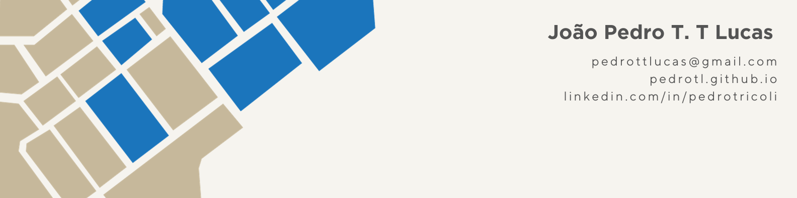

<!--
**PedroTL/PedroTL** is a ✨ _special_ ✨ repository because its `README.md` (this file) appears on your GitHub profile.

Here are some ideas to get you started:

- 🔭 I’m currently working on ...
- 🌱 I’m currently learning ...
- 👯 I’m looking to collaborate on ...
- 🤔 I’m looking for help with ...
- 💬 Ask me about ...
- 📫 How to reach me: ...
- 😄 Pronouns: ...
- ⚡ Fun fact: ...
-->

### Hi there 👋
---
I'm João Pedro T. T. Lucas, an research assistant at the [Pontifical Catholic University of Campinas Observatory](https://observatorio.puc-campinas.edu.br/) in Brazil.

### Intrests
---
I'm deeply passionate about academic research, particularly in the field of regional and development economics. My focus revolves around using spatial and data analysis to visualize and comprehend crucial indicators that significantly impact society.

- Regional Economy
- Spatial Data Analysis
- GIS
- Urban Vulnerability
- Crime Economy

### Experience
---
Since 2022, I've been actively engaged as an research assistant. I actively work in two prominent extension programs. The first, focused on the Productive Structure and Socioeconomic Development, conducting comprehensive studies on the foreign trade within the Metropolitan Region of Campinas (MRC). The second, in partnership with the [FEAC foundation](https://feac.org.br/), conducting a Social Territory Diagnosis. This involved analyzing microdata from the federal program Unified Registry (Cadastro Único), contributing to the development of a unique [geocoding](https://feac.org.br/wp-content/uploads/2023/10/Geocodificacao_FEAC.pdf?portfolioCats=3105#new_tab) methodology for registered families. In both projects, my research delved into regional economic indicators, aiming to offer valuable insights to support key sectors of the economy.

For more information about me, visit my [portifolio](https://pedrotl.github.io/)

----

  

  

  

  <!--
  

-->

 

